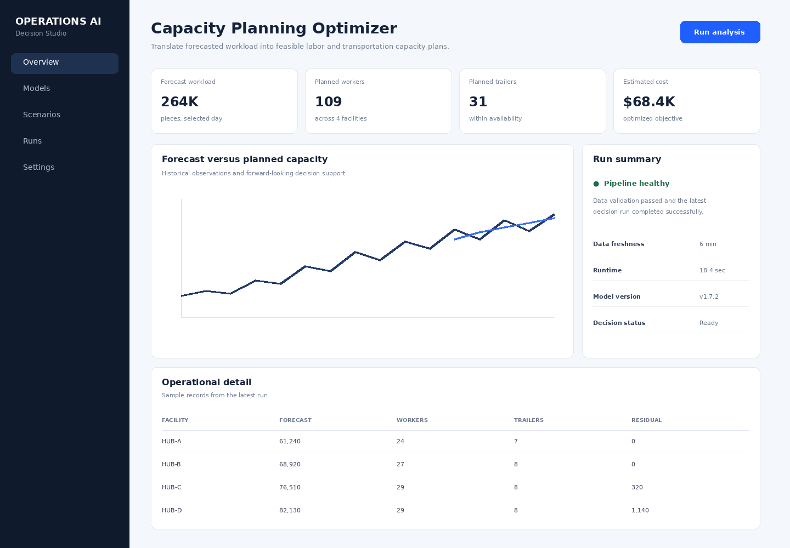

# Forecast-Driven Capacity Optimizer

A practical **Mixed Integer Linear Programming (MILP)** tutorial and production starter for converting forecasted workload into labor and transportation capacity decisions. The repository is solver-aware: the same Pyomo model can run with **Gurobi, CPLEX or HiGHS**, while separate direct-API examples show how the formulation looks in `gurobipy` and DOcplex. All sample data is synthetic.



## Business question

A daily network forecast is only useful if it changes a decision. This project asks: **given expected workload, local processing productivity, staffing limits and trailer availability, what is the lowest-cost feasible capacity plan?**

The model balances four practical concerns: meeting predicted demand, controlling labor cost, controlling transportation capacity cost, and heavily penalizing workload that remains unprocessed.

## Mathematical formulation

For each facility `f`:

- `workers[f]` = integer number of worker shifts scheduled.
- `trailers[f]` = integer number of transportation units assigned.
- `unprocessed[f]` = residual demand that cannot be covered.

A simplified capacity constraint is:

```text
worker_productivity[f] * workers[f]
+ trailer_capacity[f] * trailers[f]
+ unprocessed[f]
>= forecast_demand[f]
```

The objective minimizes labor + transportation + a large shortage penalty. Hard constraints enforce maximum staffing and available trailers. The formulation is intentionally understandable, but the code structure supports adding shift calendars, overtime tiers, skill classes, sort-machine capacity, service-level penalties and cross-facility balancing.

## Solver strategy

`src/model.py` uses Pyomo and accepts a solver name:

```python
plan = solve(input_data, solver="gurobi")
plan = solve(input_data, solver="cplex")
plan = solve(input_data, solver="highs")
```

Commercial solvers require their normal installations and licenses. HiGHS is the default local-development choice, which allows the tutorial to run without commercial licensing. The repository also contains:

- `src/solver_examples/gurobi_direct.py` – direct `gurobipy` model.
- `src/solver_examples/cplex_direct.py` – direct DOcplex model.

That separation is useful in real teams: formulation logic can remain solver-neutral while performance-critical deployments can use a solver-specific API when necessary.

## Data

`data/capacity_scenarios.csv` is generated from a deterministic script and includes date, facility, forecasted pieces, pieces per worker shift, max workers, available trailers and trailer capacity.

```bash
python src/generate_data.py
```

## Run locally

```bash
python -m venv .venv
source .venv/bin/activate
pip install -r requirements.txt
python src/generate_data.py
uvicorn app.api:app --reload
```

Then request a scenario:

```bash
curl -X POST http://localhost:8000/optimize \
  -H 'Content-Type: application/json' \
  -d '{"date":"2026-01-05","solver":"highs","demand_multiplier":1.10}'
```

The `demand_multiplier` is intentionally exposed for what-if analysis. A planner can ask what changes under a +10% peak scenario without retraining a forecast model.

## Architecture

```text
Forecast table --> scenario API --> MILP model --> solver adapter --> capacity plan
                                      |
                                      +--> Gurobi
                                      +--> CPLEX
                                      +--> HiGHS
```

## Productionization

A production version would obtain demand from a registered forecasting pipeline, retrieve current worker/trailer availability from operational systems, write each optimization request and solver status to an auditable run table, and publish the approved plan through an API or planner UI. Important operational metrics include solver runtime, optimality gap, infeasibility rate, forecast error, shortage volume, overtime and plan overrides.

## Why this repository is useful as a tutorial

The code keeps the optimization formulation small enough to understand from the README, but uses patterns that scale: explicit decision variables, objective function, hard constraints, solver abstraction, scenario inputs, API serving, frontend, containers and CI. This makes it suitable both for learning MILP and as a seed for a more complex planning service.
